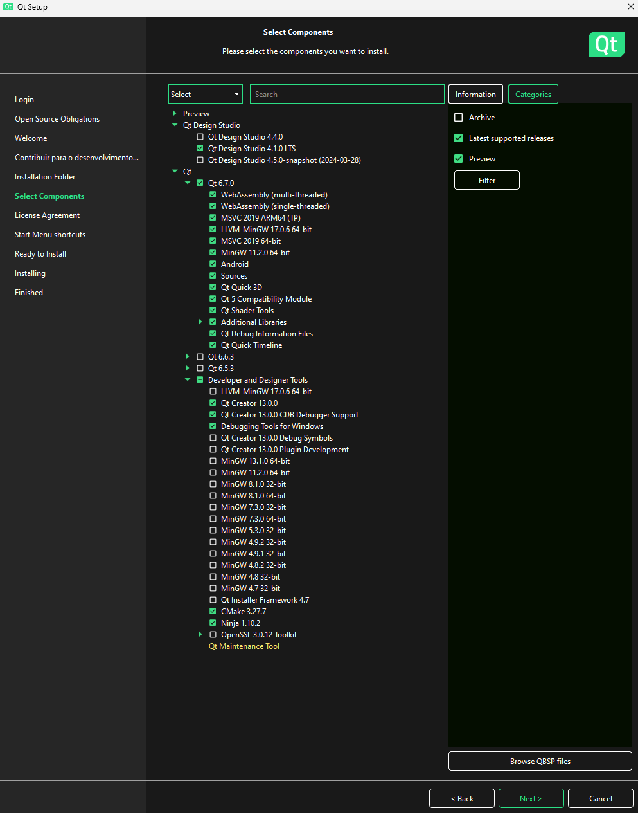

# SeriesGratisOnlineFreeHD
APP de Seriados feito com QT, QML e C++ . 

Ele consome os dados da TVmaze API (https://www.tvmaze.com/api). Créditos totais.

## Arquitetura:

Backend:
Foi usada uma arquitetura de Camadas, cada uma com uma função no sistema.
Integration: Contem classes que se ligam com APIs/endpoints e transformam os dados obtidos em um formato aceito pelo sistema.
Service: Recebe os dados do Integration e faz a logica de negócio.
Delegate: Camada de transporte, também pode ser usada para validações. Como por exemplo Trasactions/Commits/Rollbacks (caso houvesse banco de dados no sistema).
Controller: Faz a exposição dos dados para o Front-End

Frontend:
Control: Contem classes que conectam com o Backend e com a UI (QML), permitindo troca de dados.

## Sobre do Ambiente de Desenvolvimento:

SO: Windows 11

Qt: 6.7

QtCreator: 13.0.0  - Based on Qt 6.6.0 (MSVC 2019, x86_64)

Kit: Desktop Qt 6.7.0 MinGW 64-bit

Build System: QMake

## Instalação do Ambiente de Desenvolvimento:

1 - Faça o download do Qt 6.7 e do QtCreator 13 (versão Free) no seguinte link:

https://www.qt.io/download-qt-installer-oss	

2 - Faça abra o Instalador baixado e avance até o seguinte passo, clicando em "Instalação Personalizada"

3 - Instale o Qt 6.7 junto com os componentes extras (igual na imagem abaixo)

4 - Avance os passos até a instalação ser concluida.

